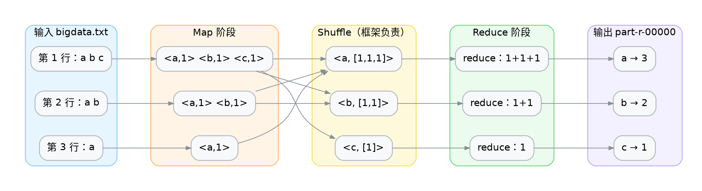
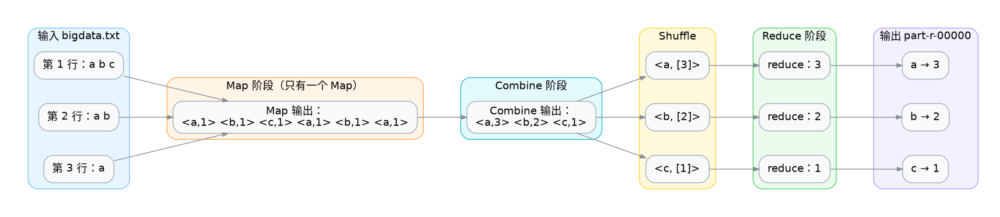
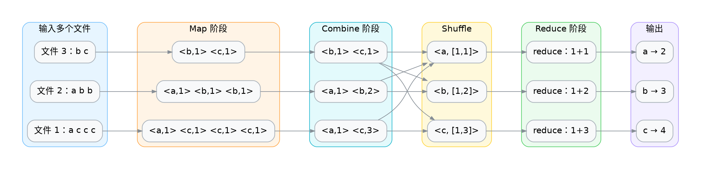

### MapReduce

```graphviz
digraph MapReduce {
  rankdir=LR;
  compound=true;
  newrank=true;
  graph [fontname="Helvetica", pad=0.4, nodesep=0.4, ranksep=0.9,
         splines=spline];
  node  [fontname="Helvetica", shape=box, style="rounded,filled",
         fillcolor="#F8F9FA", color="#ADB5BD", penwidth=1.2,
         margin="0.15,0.08"];
  edge  [fontname="Helvetica", color="#868E96", arrowsize=0.7];

  subgraph cluster_in {
    label="输入 bigdata.txt";
    style="rounded,filled"; color="#74C0FC"; fillcolor="#E7F5FF";
    I1 [label="第 1 行：a b c", group=g1];
    I2 [label="第 2 行：a b",   group=g2];
    I3 [label="第 3 行：a",     group=g3];
  }

  subgraph cluster_map {
    label="Map 阶段";
    style="rounded,filled"; color="#FFA94D"; fillcolor="#FFF4E6";
    M1 [label=<&lt;a,1&gt; &lt;b,1&gt; &lt;c,1&gt;>, group=g1];
    M2 [label=<&lt;a,1&gt; &lt;b,1&gt;>,             group=g2];
    M3 [label=<&lt;a,1&gt;>,                       group=g3];
  }

  subgraph cluster_shuffle {
    label="Shuffle（框架负责）";
    style="rounded,filled"; color="#FFD43B"; fillcolor="#FFF9DB";
    G1 [label=<&lt;a, [1,1,1]&gt;>, group=g1];
    G2 [label=<&lt;b, [1,1]&gt;>,   group=g2];
    G3 [label=<&lt;c, [1]&gt;>,     group=g3];
  }

  subgraph cluster_reduce {
    label="Reduce 阶段";
    style="rounded,filled"; color="#51CF66"; fillcolor="#EBFBEE";
    R1 [label="reduce：1+1+1", group=g1];
    R2 [label="reduce：1+1",   group=g2];
    R3 [label="reduce：1",     group=g3];
  }

  subgraph cluster_out {
    label="输出 part-r-00000";
    style="rounded,filled"; color="#B197FC"; fillcolor="#F3F0FF";
    O1 [label="a → 3", group=g1];
    O2 [label="b → 2", group=g2];
    O3 [label="c → 1", group=g3];
  }

  // 真实数据流
  I1 -> M1;
  I2 -> M2;
  I3 -> M3;

  M1 -> G1;
  M1 -> G2;
  M1 -> G3;
  M2 -> G1;
  M2 -> G2;
  M3 -> G1;

  G1 -> R1 -> O1;
  G2 -> R2 -> O2;
  G3 -> R3 -> O3;

  // 关键：不可见边，把每个 G 的入度补齐到 3 条
  // G2 实际缺 M3，G3 实际缺 M2、M3
  M3 -> G2 [style=invis, weight=1];
  M2 -> G3 [style=invis, weight=1];
  M3 -> G3 [style=invis, weight=1];
}
```

### Partitioner

```graphviz
digraph MapReduce {
  rankdir=LR;
  compound=true;
  newrank=true;
  graph [fontname="Helvetica", pad=0.4, nodesep=0.4, ranksep=0.9,
         splines=spline];
  node  [fontname="Helvetica", shape=box, style="rounded,filled",
         fillcolor="#F8F9FA", color="#ADB5BD", penwidth=1.2,
         margin="0.15,0.08"];
  edge  [fontname="Helvetica", color="#868E96", arrowsize=0.7];

  subgraph cluster_in {
    label="输入 bigdata.txt";
    style="rounded,filled"; color="#74C0FC"; fillcolor="#E7F5FF";
    I1 [label="第 1 行：a b c", group=g1];
    I2 [label="第 2 行：a b",   group=g2];
    I3 [label="第 3 行：a",     group=g3];
  }

  subgraph cluster_map {
    label="Map 阶段";
    style="rounded,filled"; color="#FFA94D"; fillcolor="#FFF4E6";
    M1 [label=<&lt;a,1&gt; &lt;b,1&gt; &lt;c,1&gt;>, group=g1];
    M2 [label=<&lt;a,1&gt; &lt;b,1&gt;>,             group=g2];
    M3 [label=<&lt;a,1&gt;>,                       group=g3];
  }

  subgraph cluster_partition {
    label="Partition 阶段（hash(key) % 3）";
    style="rounded,filled"; color="#F783AC"; fillcolor="#FFF0F6";
    Q1 [label=<P0:&lt;b,1&gt;  P1:&lt;c,1&gt;  P2:&lt;a,1&gt;>, group=g1];
    Q2 [label=<P0:&lt;b,1&gt;  P1:—        P2:&lt;a,1&gt;>, group=g2];
    Q3 [label=<P0:—        P1:—        P2:&lt;a,1&gt;>, group=g3];
  }

  subgraph cluster_shuffle {
    label="Shuffle（框架负责）";
    style="rounded,filled"; color="#FFD43B"; fillcolor="#FFF9DB";
    G1 [label=<P2 &rarr; &lt;a, [1,1,1]&gt;>, group=g1];
    G2 [label=<P0 &rarr; &lt;b, [1,1]&gt;>,   group=g2];
    G3 [label=<P1 &rarr; &lt;c, [1]&gt;>,     group=g3];
  }

  subgraph cluster_reduce {
    label="Reduce 阶段";
    style="rounded,filled"; color="#51CF66"; fillcolor="#EBFBEE";
    R0 [label="Reduce(P2)：1+1+1", group=g1];
    R1 [label="Reduce(P0)：1+1",   group=g2];
    R2 [label="Reduce(P1)：1",     group=g3];
  }

  subgraph cluster_out {
    label="输出目录";
    style="rounded,filled"; color="#B197FC"; fillcolor="#F3F0FF";
    O0 [label="part-r-00002：a → 3", group=g1];
    O1 [label="part-r-00000：b → 2", group=g2];
    O2 [label="part-r-00001：c → 1", group=g3];
  }

  // ---------- 真实数据流 ----------

  // Input -> Map
  I1 -> M1;
  I2 -> M2;
  I3 -> M3;

  // Map -> Partition
  M1 -> Q1;
  M2 -> Q2;
  M3 -> Q3;

  // Partition -> Shuffle（P2 汇 a、P0 汇 b、P1 汇 c）
  Q1 -> G1;   // P2: a
  Q1 -> G2;   // P0: b
  Q1 -> G3;   // P1: c
  Q2 -> G1;   // P2: a
  Q2 -> G2;   // P0: b
  Q3 -> G1;   // P2: a

  // Shuffle -> Reduce -> Output
  G1 -> R0 -> O0;   // P2 → part-r-00002
  G2 -> R1 -> O1;   // P0 → part-r-00000
  G3 -> R2 -> O2;   // P1 → part-r-00001

  // ---------- 不可见边：补齐 G 的入度，保持横向对齐 ----------
  Q2 -> G3 [style=invis, weight=1];
  Q3 -> G2 [style=invis, weight=1];
  Q3 -> G3 [style=invis, weight=1];
}
```

### Combiner

#### OneMapOneReducer

```graphviz
digraph CombinerSingleMap {
  rankdir=LR;
  compound=true;
  newrank=true;
  graph [fontname="Helvetica", pad=0.4, nodesep=0.45, ranksep=0.9,
         splines=spline];
  node  [fontname="Helvetica", shape=box, style="rounded,filled",
         fillcolor="#F8F9FA", color="#ADB5BD", penwidth=1.2,
         margin="0.15,0.08"];
  edge  [fontname="Helvetica", color="#868E96", arrowsize=0.7];

  subgraph cluster_in {
    label="输入 bigdata.txt";
    style="rounded,filled"; color="#74C0FC"; fillcolor="#E7F5FF";
    I1 [label="第 1 行：a b c", group=g1];
    I2 [label="第 2 行：a b",   group=g2];
    I3 [label="第 3 行：a",     group=g3];
  }

  subgraph cluster_map {
    label="Map 阶段（只有一个 Map）";
    style="rounded,filled"; color="#FFA94D"; fillcolor="#FFF4E6";
    M [label=<Map 输出：<br/>&lt;a,1&gt; &lt;b,1&gt; &lt;c,1&gt; &lt;a,1&gt; &lt;b,1&gt; &lt;a,1&gt;>, group=g2];
  }

  subgraph cluster_combine {
    label="Combine 阶段";
    style="rounded,filled"; color="#22B8CF"; fillcolor="#E3FAFC";
    C [label=<Combine 输出：<br/>&lt;a,3&gt; &lt;b,2&gt; &lt;c,1&gt;>, group=g2];
  }

  subgraph cluster_shuffle {
    label="Shuffle";
    style="rounded,filled"; color="#FFD43B"; fillcolor="#FFF9DB";
    G1 [label=<&lt;a, [3]&gt;>, group=g1];
    G2 [label=<&lt;b, [2]&gt;>, group=g2];
    G3 [label=<&lt;c, [1]&gt;>, group=g3];
  }

  subgraph cluster_reduce {
    label="Reduce 阶段";
    style="rounded,filled"; color="#51CF66"; fillcolor="#EBFBEE";
    R1 [label="reduce：3", group=g1];
    R2 [label="reduce：2", group=g2];
    R3 [label="reduce：1", group=g3];
  }

  subgraph cluster_out {
    label="输出 part-r-00000";
    style="rounded,filled"; color="#B197FC"; fillcolor="#F3F0FF";
    O1 [label="a → 3", group=g1];
    O2 [label="b → 2", group=g2];
    O3 [label="c → 1", group=g3];
  }

  // 三行输入进入同一个 Map
  I1 -> M;
  I2 -> M;
  I3 -> M;

  // 同一个 Map 的输出进入同一个 Combiner
  M -> C;

  // Combiner 后按 key 进入 Shuffle 分组
  C -> G1;
  C -> G2;
  C -> G3;

  G1 -> R1 -> O1;
  G2 -> R2 -> O2;
  G3 -> R3 -> O3;
}
```

#### 3MapTask-1ReduceTask

```graphviz
digraph Combiner {
  rankdir=LR;
  compound=true;
  newrank=true;
  graph [fontname="Helvetica", pad=0.4, nodesep=0.4, ranksep=0.9,
         splines=spline];
  node  [fontname="Helvetica", shape=box, style="rounded,filled",
         fillcolor="#F8F9FA", color="#ADB5BD", penwidth=1.2,
         margin="0.15,0.08"];
  edge  [fontname="Helvetica", color="#868E96", arrowsize=0.7];

  subgraph cluster_in {
    label="输入多个文件";
    style="rounded,filled"; color="#74C0FC"; fillcolor="#E7F5FF";
    I1 [label="文件 3：b c", group=g1];
    I2 [label="文件 2：a b b",     group=g2];
    I3 [label="文件 1：a c c c",   group=g3];
  }

  subgraph cluster_map {
    label="Map 阶段";
    style="rounded,filled"; color="#FFA94D"; fillcolor="#FFF4E6";
    M1 [label=<&lt;b,1&gt; &lt;c,1&gt;>, group=g1];
    M2 [label=<&lt;a,1&gt; &lt;b,1&gt; &lt;b,1&gt;>,                         group=g2];
    M3 [label=<&lt;a,1&gt; &lt;c,1&gt; &lt;c,1&gt; &lt;c,1&gt;>,             group=g3];
  }

  subgraph cluster_combine {
    label="Combine 阶段";
    style="rounded,filled"; color="#22B8CF"; fillcolor="#E3FAFC";
    C1 [label=<&lt;b,1&gt; &lt;c,1&gt;>, group=g1];
    C2 [label=<&lt;a,1&gt; &lt;b,2&gt;>,             group=g2];
    C3 [label=<&lt;a,1&gt; &lt;c,3&gt;>,             group=g3];
  }

  subgraph cluster_shuffle {
    label="Shuffle";
    style="rounded,filled"; color="#FFD43B"; fillcolor="#FFF9DB";
    G1 [label=<&lt;a, [1,1]&gt;>, group=g1];
    G2 [label=<&lt;b, [1,2]&gt;>,   group=g2];
    G3 [label=<&lt;c, [1,3]&gt;>,   group=g3];
  }

  subgraph cluster_reduce {
    label="Reduce 阶段";
    style="rounded,filled"; color="#51CF66"; fillcolor="#EBFBEE";
    R1 [label="reduce：1+1", group=g1];
    R2 [label="reduce：1+2",   group=g2];
    R3 [label="reduce：1+3",   group=g3];
  }

  subgraph cluster_out {
    label="输出";
    style="rounded,filled"; color="#B197FC"; fillcolor="#F3F0FF";
    O1 [label="a → 2", group=g1];
    O2 [label="b → 3", group=g2];
    O3 [label="c → 4", group=g3];
  }

  // 真实数据流
  I1 -> M1;
  I2 -> M2;
  I3 -> M3;

  M1 -> C1;
  M2 -> C2;
  M3 -> C3;

  C1 -> G1;
  C1 -> G2;
  C1 -> G3;
  C2 -> G1;
  C2 -> G2;
  C3 -> G1;
  C3 -> G3;

  G1 -> R1 -> O1;
  G2 -> R2 -> O2;
  G3 -> R3 -> O3;

  // 不可见边，把每个 G 的入度补齐到 3 条
  // G2 实际缺 C3，G3 实际缺 C2
  C3 -> G2 [style=invis, weight=1];
  C2 -> G3 [style=invis, weight=1];
}
```

