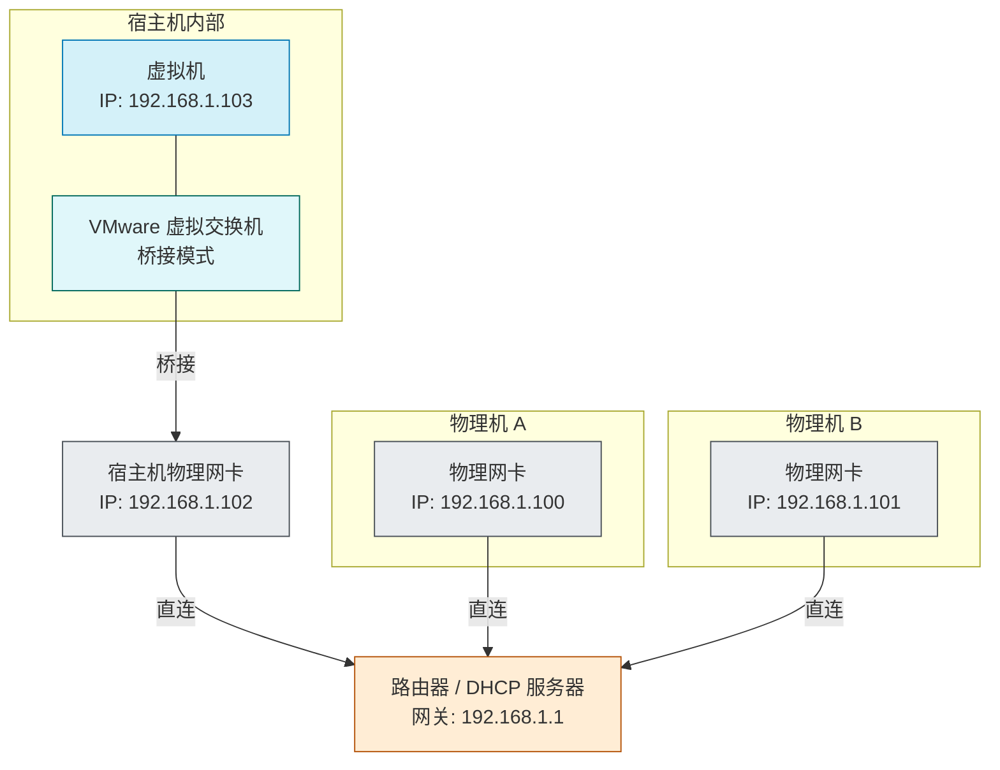

### 桥接

```mermaid
flowchart TD
    subgraph Host [宿主机内部]
        VM[虚拟机<br>IP: 192.168.1.103]
        VMnet0[VMware 虚拟交换机<br>桥接模式]
        VM --- VMnet0
    end

    subgraph PhysA [物理机 A]
        NIC_A[物理网卡<br>IP: 192.168.1.100]
    end

    subgraph PhysB [物理机 B]
        NIC_B[物理网卡<br>IP: 192.168.1.101]
    end

    Router[路由器 / DHCP 服务器<br>网关: 192.168.1.1]

    Host_NIC[宿主机物理网卡<br>IP: 192.168.1.102]

    VMnet0 -- 桥接 --> Host_NIC
    Host_NIC -- 直连 --> Router
    NIC_A -- 直连 --> Router
    NIC_B -- 直连 --> Router

    style VM fill:#d4f1f9,stroke:#0077b6
    style VMnet0 fill:#e0f7fa,stroke:#00695c
    style Router fill:#ffedd5,stroke:#b45309
    style Host_NIC fill:#e9ecef,stroke:#495057
    style NIC_A fill:#e9ecef,stroke:#495057
    style NIC_B fill:#e9ecef,stroke:#495057
```

